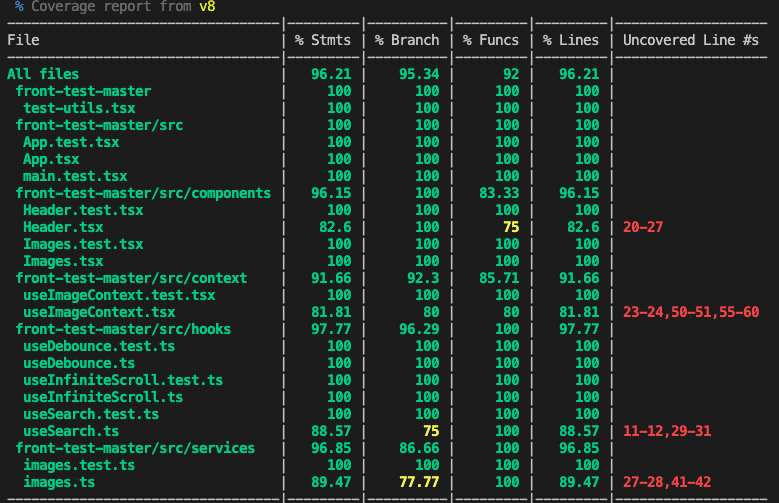

# Requerimientos

Necesitamos desarrollar una Single Page Application (SPA) que muestre la información de nuestras imagenes:
  1. Mostrar todas las imagenes con un scroll infinito.
  2. Filtrar el contenido a través de una búsqueda (No es necesario que el resultado sea coherente).
  3. Realizar un like/unlike de cada uno de los items. UI responsive.

# Información

En el momento del desarrollo de la aplicación cliente, el API no se encuentra desarrollada, por
lo que esta incluida una api mock que simula el comportamiento de la API.

Para arrancar la api mock simplemente ejecutar:

`npm run mocks`

## Endpoints

### `GET http://localhost:3100/images`
```json
[
  {
    "type": "Image",
    "id": 2,
    "title": "Train in India-Agra",
    "author": "SamyRoad",
    "created_at": "2012-12-12T21: 08: 20Z",
    "main_attachment": {
      "big": "http://lorempixel.com/400/500/",
      "small": "http://lorempixel.com/100/125/"
    },
    "likes_count": 5,
    "liked": true,
    "links": [
      {
        "rel": "avatar",
        "uri": "http://lorempixel.com/250/250/",
        "methods": "GET"
      },
      {
        "rel": "like",
        "uri": "http://localhost:3100/images/2/likes",
        "methods": "POST"
      }
    ]
  },
  ...
]
```

Se puede utilizar los query params `search` y `page` para simular la busqueda y paginación.


### `POST http://localhost:3100/images/:id/likes`

Espera un body vacio y respondera con un 204 si todo ha ido correctamente, simula la acción de like.

# Diseño

La visualización de la aplicación cambia dependiendo del dispositivo que se este utilizando.
- En el caso de que se utilice un dispositivo móvil, se debe de mostrar la aplicación siguiendo el diseño mobile.psd.
- En el caso que se utilice una pantalla mayor, se debe de utilizar el diseño web.psd, con un mínimo de 2 columnas y un máximo de 4.

Los diseños se pueden encontrar [aqui](https://www.dropbox.com/sh/r1fp5nz7x046kjt/AACQdbp6bZlv2pNtCN2lTEoEa?dl=0).

Si no dispones de photoshop puedes usar [photopea](https://www.photopea.com/).

# Implementación

- Diseñar e implementar la aplicación usando preferiblemente React.
- HTML y estilos responsive a partir de los PSDs: mobile para móviles y web para Desktop.

Se valorarán el uso e implementación de tests.


# test-images-react

Esta es una aplicación web desarrollada con React y utilizando Vite como herramienta de compilación, lo que permite crear aplicaciones de manera rápida y eficiente. El proyecto está escrito en TypeScript, con un enfoque en código limpio, estructura organizada y de fácil comprensión.

Características principales:
- Vite: Utilizado como herramienta de compilación para una configuración ágil y rápida.
- TypeScript: Asegura un desarrollo más robusto con tipado estático.
- Context API: Implementado para gestionar el estado global y las peticiones a la API.
- Custom Hooks: Se crearon para una separación clara de responsabilidades y un código más fácil de mantener. Algunos ejemplos incluyen el uso de hooks personalizados como useDebounce para optimizar el filtrado al escribir.
- Debounce: El hook useDebounce asegura que la petición de filtrado de imágenes se realice solo cuando el usuario deja de escribir, evitando llamadas excesivas a la API.
- Diseño responsive: Se ha desarrollado tanto para web como para dispositivos móviles.
- Validaciones: Se incluyen validaciones durante el proceso de filtrado de imágenes para mejorar la experiencia del usuario.
- Infinite Scroll: Al hacer scroll, se carga más contenido automáticamente y se muestra un indicador de carga.
- Pruebas unitarias: Se han implementado tests unitarios utilizando Jest y Vitest para garantizar la funcionalidad correcta de la aplicación.
- Pasos para ejecutar el proyecto:

Instalar dependencias:
`npm install`
Ejecuta este comando para instalar todas las dependencias necesarias para que el proyecto funcione correctamente.

Simular la API con mocks:
`npm run mocks`
Este comando ejecuta @mocks-server/main, que simula las respuestas de la API, permitiendo realizar pruebas sin necesidad de una API real.

Ejecutar la aplicación:
`npm run dev`
Este comando inicia el servidor de desarrollo, donde podrás ver la interfaz gráfica y probar la funcionalidad de la aplicación.

